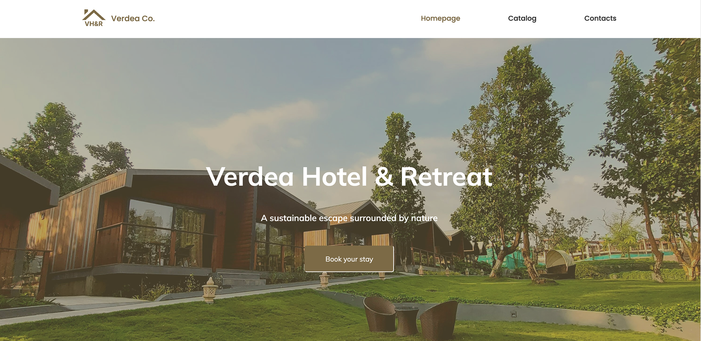
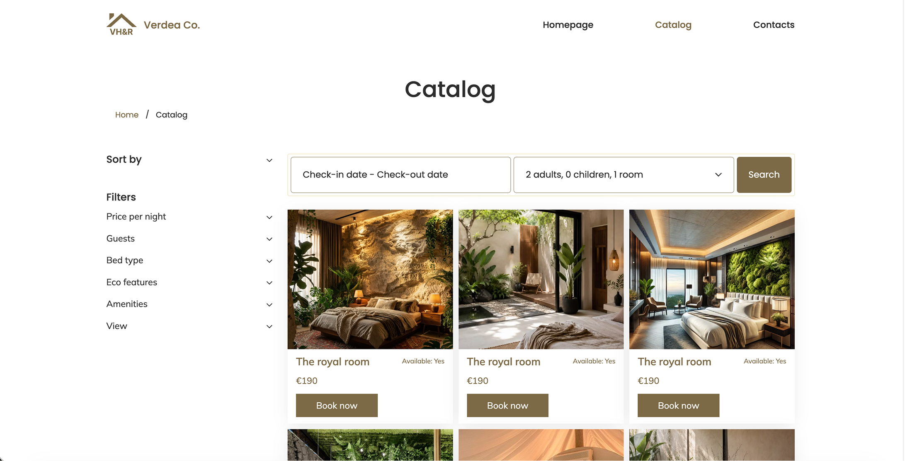

# Verdea Hotel & Retreat

Responsive multi-page eco-hotel catalog website built with HTML5, CSS3, JavaScript, Flatpickr and Figma.

## Project Overview

Verdea Hotel & Retreat is an adaptive multi-page catalog site for an eco-hotel. The project focuses on semantic HTML, a modern responsive layout, and maintainable CSS architecture.

The current implementation includes an interactive booking experience in the catalog:

- Flatpickr-powered date picker (CDN)
- Range selection for check-in / check-out with rendered input span
- Guest and room counters (adults, children, rooms)
- Live guest summary that updates as counters change

## Preview

Screenshots are included in the repo (no live demo available):




## Tech Stack

- HTML5
- CSS3 (responsive)
- JavaScript
- Flatpickr (CDN)
- Figma (design reference)

## Pages

- Home
- Catalog (with booking widget)
- Contacts (feedback form)

## Getting Started

These instructions show how to open the project locally for development or review.

1. Clone the repo (if needed):

```bash
git clone https://github.com/HannaInIT/verdea-hotel-retreat.git
cd verdea-hotel-retreat
```

2. Quick view (open in browser):

```bash
open index.html
```

3. Or run a simple static server (recommended to avoid CORS issues):

```bash
python3 -m http.server 8000
# then open http://localhost:8000

# or, if you have Node.js installed:
npx serve .
```

## Usage

- Edit page content: HTML files at the repo root.
- Styles: `css/style.css` — update variables and layout there.
- Scripts: `js/script.js` — booking widget logic and DOM interactions.
- Images: `images/` — replace screenshots or assets.

## Development

- Recommended: VS Code, Live Server extension for fast reloads.
- Linting/formatting: use your preferred HTML/CSS/JS linters (not included).
- To test booking widget behavior, open the Catalog page and interact with the date picker and counters.

## Folder Structure

- `index.html` — Home
- `catalog.html` — Catalog with booking widget
- `contacts.html` — Contact/feedback form
- `css/` — styles (style.css)
- `js/` — JavaScript (script.js)
- `images/` — screenshots and assets

## Functional Requirements

- Responsive multi-page eco-hotel catalog website
- Two main breakpoints: Mobile and Desktop
- HTML5 form validation for name, phone, check-in and check-out
- Interactive booking widget with date-range picker and guest/room selectors

## Known Issues

- No live demo link available (local preview only).
- If Flatpickr CDN is unavailable, the date picker will not initialize — consider adding a local fallback.
